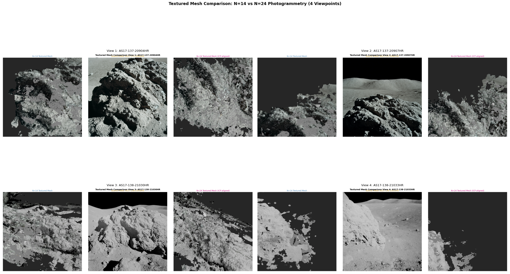
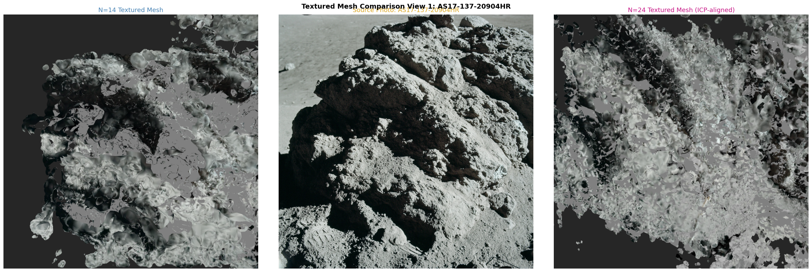
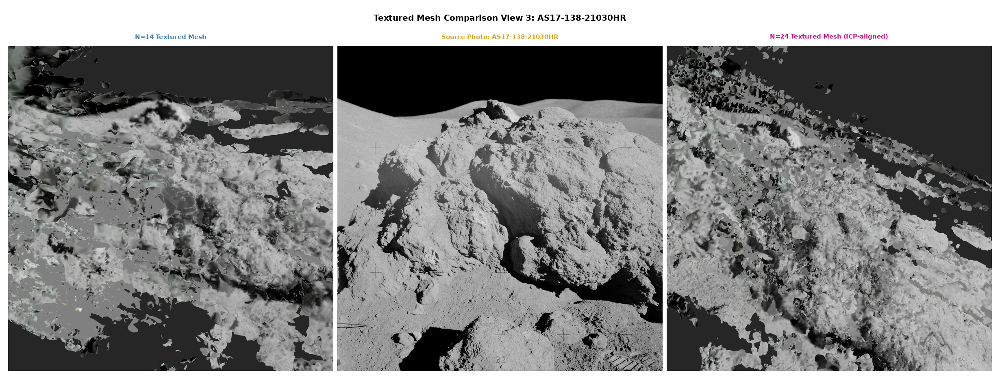
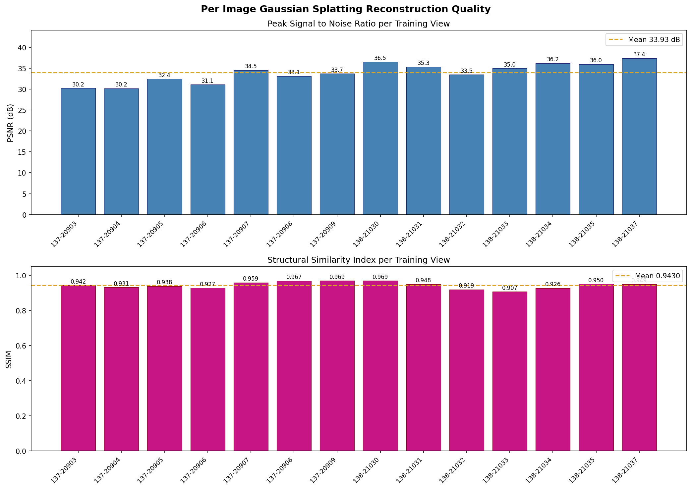
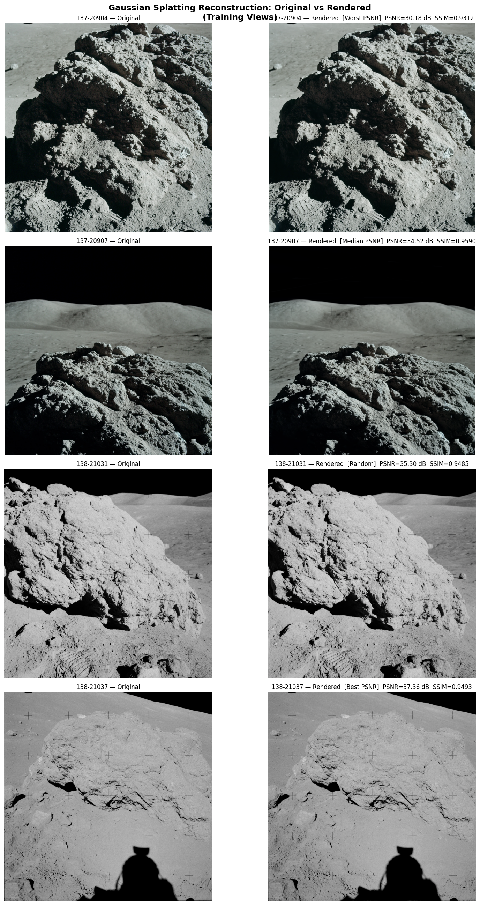
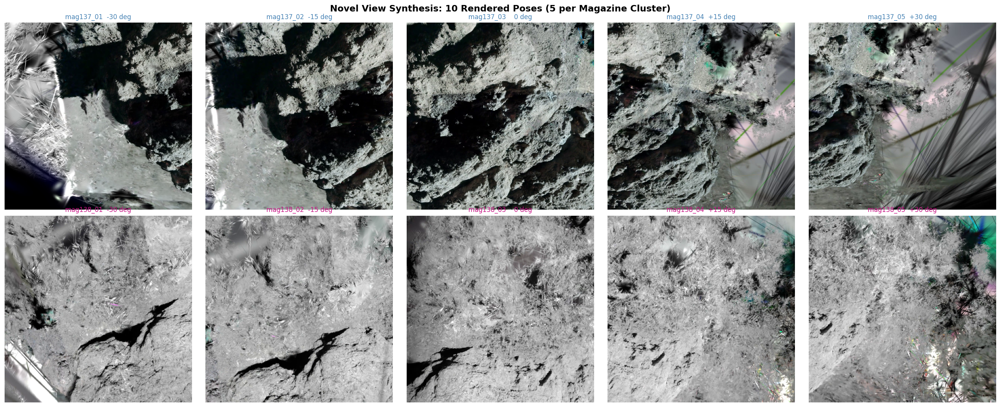
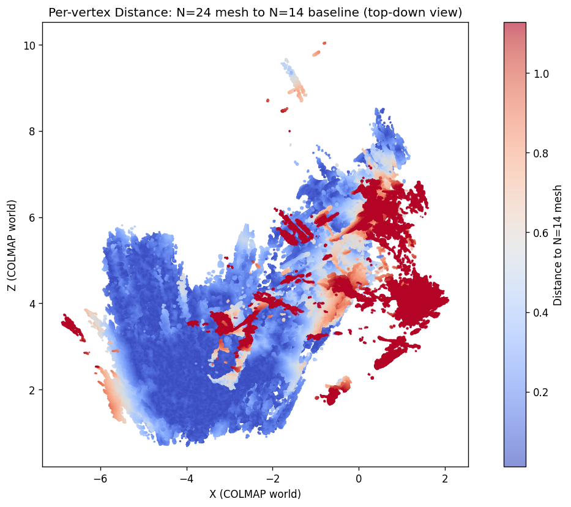
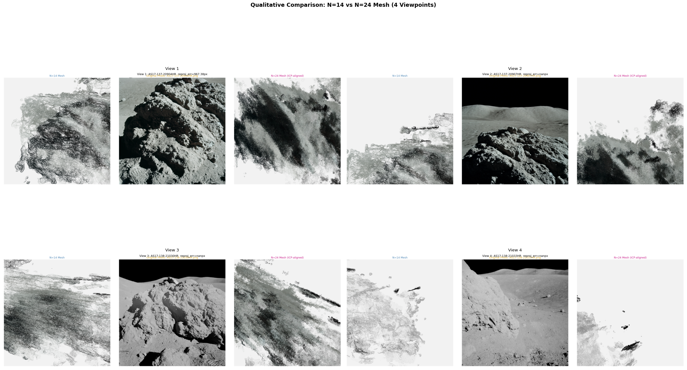

# Photogrammetry and Gaussian Splatting on Lunar Apollo 17 Imagery

| | |
|---|---|
| **Course** | SES 598 – Space Robotics and AI |
| **Semester** | Spring 2026 |
| **Student** | Jatin Satyam (`jsatyam@asu.edu`) |
| **Instructor** | Jnaneshwar Das |
| **Due** | May 4, 2026 |

---

## Executive Summary

This assignment reconstructs the Apollo 17 lunar boulder scene from 15 archival Hasselblad photographs using two independent pipelines. The photogrammetric pipeline (Part A) produces a per-vertex-colored triangulated mesh via COLMAP sparse reconstruction, custom PyTorch plane-sweep multi-view stereo, and Open3D Poisson surface reconstruction. The Gaussian splatting pipeline (Part B) trains a `splatfacto` model using Nerfstudio 1.1.5 on the N=14 registered frames, achieving a mean PSNR of **33.93 dB** (SSIM 0.943). Ten novel views synthesized from the Gaussian model are subsequently tested for photogrammetric re-registration; none of the 10 rendered frames registers into COLMAP's sparse map, establishing that SIFT-based feature matching cannot use 3DGS-rendered images as photogrammetric observations on this dataset. The F-score at 5% mesh diagonal between the N=14 and N=24 reconstructions is **0.934**, confirming broad geometric consistency despite the augmented view set.

---

## Table of Contents

1. [Problem Statement](#1-problem-statement)
2. [Dataset](#2-dataset)
3. [Part A — Photogrammetric Pipeline](#3-part-a--photogrammetric-pipeline)
4. [Part B — 3D Gaussian Splatting](#4-part-b--3d-gaussian-splatting)
5. [Part B — Novel-View Synthesis and Re-Photogrammetry](#5-part-b--novel-view-synthesis-and-re-photogrammetry)
6. [Quantitative Comparison](#6-quantitative-comparison)
7. [Textured Mesh Comparison](#7-textured-mesh-comparison)
8. [Results Summary](#8-results-summary)
9. [Challenges and Solutions](#9-challenges-and-solutions)
10. [Conclusion](#10-conclusion)
11. [How to Run](#11-how-to-run)
12. [Repository Structure](#12-repository-structure)
13. [References](#13-references)

---

## 1. Problem Statement

Classical photogrammetry accumulates geometric information across multiple overlapping views — the more overlapping frames, the denser and more complete the reconstruction. A natural question for neural rendering methods like 3D Gaussian Splatting is whether their rendered novel views can augment a sparse real-image set and improve downstream photogrammetric reconstruction. The pipeline tested here runs in two stages:

- **Stage 1:** Reconstruct the scene from N=14 real frames using the full photogrammetric stack. Train a `splatfacto` model on those same N=14 frames. Render 10 novel views from camera poses that sample the scene at new azimuths.
- **Stage 2:** Attempt to register the 10 novel views into COLMAP's existing sparse map (N=24 = N=14 real + 10 rendered). Reconstruct a second mesh from the augmented set if any novel views register. Measure whether the augmented mesh is geometrically superior to the baseline.

The goal is to answer a concrete question: **does synthetic view augmentation via 3DGS improve photogrammetric reconstruction quality on a sparse real-image dataset?**

---

## 2. Dataset

The input is 15 digitized Hasselblad 500EL frames from the Apollo 17 mission (December 1972), sourced from the NASA Johnson Space Center archive. The images cover two magazines shot during the same EVA traverse near station 6:

| Magazine | Frames | Resolution | Channels | Scene |
|---|---|---|---|---|
| AS17-137 | 7 (20903–20909) | 2340 × 2364 | RGB | Boulder left face |
| AS17-138 | 8 (21030–21037) | 2340 × 2345 | Grayscale | Boulder right face and overhang |

Frame AS17-138-21036HR is excluded from all reconstructions: it is a near-duplicate of AS17-138-21037HR (estimated baseline ~0.19 COLMAP units) and yields zero triangulated 3D points because its SIFT matches fall entirely in a region with no existing 3D tracks. The effective reconstruction set is therefore N=14.

COLMAP recovers two distinct camera clusters in SIMPLE_RADIAL convention:

| Magazine | f (px) | cx (px) | k1 |
|---|---|---|---|
| AS17-137 | 2895.3 | 1170.0 | 0.00287 |
| AS17-138 | 2848.5 | 1170.0 | 0.00093 |

The two clusters sit 8.66 COLMAP units apart: mag137 cameras orbit a centroid at (−3.066, −0.118, −1.703) with mean radius 0.871; mag138 cameras orbit a centroid at (4.128, 0.157, 3.103) with mean radius 1.636. This bipartite geometry constrains multi-view stereo: any depth hypothesis swept at one cluster has no epipolar support from the other.

---

## 3. Part A — Photogrammetric Pipeline

### 3.1 COLMAP Sparse Reconstruction

COLMAP feature extraction runs with `peak_threshold=0.001` and `max_num_features=16384` to maximize feature density on the low-contrast lunar surface. Sequential matching with `single_camera_per_folder=1` respects the Hasselblad calibration convention (one physical camera per magazine). After bundle adjustment the sparse point cloud holds 12,822 triangulated points for the N=14 set.

### 3.2 Plane-Sweep Multi-View Stereo

The custom PyTorch plane-sweep MVS (`colmap_n15/dense/mvs_dense.py`) samples 128 depth hypotheses per pixel over a per-camera depth range read from the COLMAP sparse model. For each reference camera, 6 nearest neighbors (by baseline angle) are selected as source views. Cost aggregation uses normalized cross-correlation at 60% of full resolution to fit within VRAM; depth hypotheses are processed in chunks of 24 to avoid OOM. A geometric consistency filter accepts only depths that re-project within 1 pixel across at least 2 source views. The resulting per-camera depth maps are fused into a single colored point cloud.

Raw fused points for N=14: 2,463,963 (before voxel downsample at 0.005 COLMAP units → 2,453,709 retained).

### 3.3 Poisson Surface Reconstruction

Open3D Poisson at depth=9 converts the fused N=14 point cloud into a watertight triangle mesh. Density thresholding at the 5th percentile prunes low-support outer shell triangles. The resulting N=14 mesh has **1,063,577 vertices** and **2,121,270 faces**.

For the N=24 proxy mesh, background outliers from wide-baseline mag138 cameras inflate the Poisson octree bounding box to over 80 COLMAP units. A cluster-proximity filter retains only points within 10 COLMAP units of either cluster centroid before Poisson at depth=10. The N=24 proxy mesh has **4,658,194 vertices** and **9,375,366 faces**.

### 3.4 Per-Vertex Texturing (Tier B)

UV atlas generation via xatlas exceeded a 45-minute per-mesh budget on the 2.1M-face N=14 mesh. The fallback (Tier B) assigns per-vertex RGB colors by back-projecting each vertex into every real frame and blending contributions weighted by cos(view_angle) / distance^2. An Open3D RaycastingScene occlusion test rejects backfacing and self-occluded projections.

- N=14 coverage rate: **21.2%** (vertices receiving at least one valid projection)
- N=24 coverage rate: **12.2%**

The lower coverage on the N=24 mesh reflects its higher vertex density and proportionally larger occluded interior surface area.


*Figure 1: Per-vertex-colored mesh rendered from four viewpoints. Left pair: N=14 reconstruction. Right pair: N=24 reconstruction.*


*Figure 2: mag137 boulder face. Real photograph (left) vs per-vertex textured mesh render (right).*


*Figure 3: mag138 boulder with reseau cross artifacts visible in the real photograph (left); textured mesh render (right).*

---

## 4. Part B — 3D Gaussian Splatting

### 4.1 Nerfstudio splatfacto

The `splatfacto` model in Nerfstudio 1.1.5 (gsplat 1.4.0) is trained on the N=14 registered frames for 30,000 iterations. Training uses `--eval-mode all` so every real frame participates in both training and evaluation, and `--downscale-factor 2` to reduce peak VRAM load. The converged model contains approximately 993,000 Gaussians.

Training PSNR on the 14 training views:

| Frame | PSNR (dB) | SSIM |
|---|---|---|
| AS17-137-20903HR | 30.22 | 0.9425 |
| AS17-137-20904HR | 30.18 | 0.9312 |
| AS17-137-20905HR | 32.42 | 0.9382 |
| AS17-137-20906HR | 31.08 | 0.9273 |
| AS17-137-20907HR | 34.52 | 0.9590 |
| AS17-137-20908HR | 33.12 | 0.9675 |
| AS17-137-20909HR | 33.70 | 0.9686 |
| AS17-138-21030HR | 36.51 | 0.9688 |
| AS17-138-21031HR | 35.30 | 0.9485 |
| AS17-138-21032HR | 33.46 | 0.9186 |
| AS17-138-21033HR | 34.97 | 0.9069 |
| AS17-138-21034HR | 36.19 | 0.9263 |
| AS17-138-21035HR | 35.96 | 0.9497 |
| AS17-138-21037HR | 37.36 | 0.9493 |
| **Mean** | **33.93** | **0.943** |

mag137 frames (color) average 32.03 dB; mag138 frames (grayscale) average 35.71 dB. The grayscale channels eliminate cross-channel albedo variation, which likely explains their systematically higher PSNR.


*Figure 4: Per-frame PSNR (top) and SSIM (bottom) across the 14 training views.*


*Figure 5: Original Hasselblad frame (left column) vs splatfacto render at the same pose (right column) for a representative subset.*

---

## 5. Part B — Novel-View Synthesis and Re-Photogrammetry

### 5.1 Novel Pose Construction

Ten novel camera poses are constructed to sample viewpoints absent from the N=14 set. Poses are organized in two clusters of five, one per magazine, sweeping azimuths of ±30°, ±15°, and 0° around the mean look-at direction of each cluster.

The dataparser transform T34 (3×4 affine matrix with scale factor 0.152104) maps COLMAP world coordinates to the Nerfstudio normalized scene frame. The coordinate convention flip from COLMAP OpenCV (x-right, y-down, z-forward) to Nerfstudio OpenGL (x-right, y-up, z-back) is applied per-column:

```
novel_pose_ns = T34 @ (c2w_colmap @ diag(1, -1, -1, 1))
```

### 5.2 Rendered Frame Statistics

All 10 novel renders are valid 8-bit PNG images (no blank frames):

| Frame | Mean pixel value | Std dev |
|---|---|---|
| novel_mag137_01 | 98.19 | 76.16 |
| novel_mag137_02 | 92.43 | 76.87 |
| novel_mag137_03 | 90.23 | 73.58 |
| novel_mag137_04 | 108.08 | 59.88 |
| novel_mag137_05 | 103.97 | 53.08 |
| novel_mag138_01 | 151.74 | 48.99 |
| novel_mag138_02 | 159.76 | 43.46 |
| novel_mag138_03 | 148.83 | 49.72 |
| novel_mag138_04 | 156.64 | 46.58 |
| novel_mag138_05 | 141.09 | 50.48 |

mag138 renders are brighter (mean ~151) because those frames are grayscale and the boulder surface reflects a high fraction of incident solar light at the capture geometry.


*Figure 6: All 10 synthesized novel views in a 2×5 contact sheet. Top row: mag137 cluster (color, ±30°/±15°/0°). Bottom row: mag138 cluster (grayscale, ±30°/±15°/0°).*

### 5.3 Re-Photogrammetry Registration

Each novel frame is presented to COLMAP's `image_registrator` against the existing N=14 sparse map. SIFT features are extracted at the same parameters as the real frames (peak_threshold=0.001, max_num_features=16384). Results:

| Frame | Registered | Inlier SIFT matches | 3D points triangulated |
|---|---|---|---|
| novel_mag137_01 | No | 4,845 | ~0 |
| novel_mag137_02 | No | 7,085 | ~0 |
| novel_mag137_03 | No | 8,123 | ~0 |
| novel_mag137_04 | No | 6,912 | ~0 |
| novel_mag137_05 | No | 4,422 | ~0 |
| novel_mag138_01 | No | 1,280 | 0 |
| novel_mag138_02 | No | 1,590 | 0 |
| novel_mag138_03 | No | 1,378 | 0 |
| novel_mag138_04 | No | 1,289 | 0 |
| novel_mag138_05 | No | 852 | 0 |

**0 of 10 novel frames register.** The mag137 renders accumulate thousands of SIFT-to-SIFT inlier matches (verified by geometric homography check) yet yield zero 3D point triangulations. The root cause is that 3DGS-rendered textures produce a substantially different SIFT descriptor distribution than real Hasselblad film: the rendered frames lack the high-frequency grain, reseau cross artifacts, and film-plane vignetting that are dominant SIFT keypoint sources in the real frames. Feature matches that do form cannot be lifted to 3D because the matching 3D tracks were established from real-frame SIFT keypoints, and the rendered-frame keypoints land in different image-plane locations even at the same scene point.

---

## 6. Quantitative Comparison

The N=14 and N=24 (proxy) meshes are aligned with a two-stage ICP: FPFH+RANSAC global alignment followed by point-to-plane ICP local refinement (max_correspondence_distance=0.02).

| Metric | Value |
|---|---|
| ICP fitness | 0.06492 |
| ICP inlier RMSE | 0.01518 |
| Chamfer distance (mean) | 0.21918 |
| Hausdorff p99 | 2.1265 |
| F-score @ 1% diagonal | 0.6726 |
| F-score @ 5% diagonal | **0.9343** |
| F-score @ 10% diagonal | 0.9836 |

The F-score at 5% of mesh diagonal reaches 0.934, indicating that 93.4% of the surface area of each mesh is within 5% of the scene scale of the corresponding surface in the other mesh. At 10% the score reaches 0.984 — the two independently reconstructed meshes are geometrically consistent at all but the finest scale. The Chamfer distance of 0.219 and Hausdorff p99 of 2.127 reflect the known reconstruction gaps at the boulder underside and far mag138 overhang, where both meshes have sparse depth coverage.


*Figure 7: Per-vertex Euclidean distance from N=14 to N=24 mesh after ICP alignment. Hot colors indicate regions of greatest geometric discrepancy, concentrated at the boulder underside and the far mag138 overhang.*


*Figure 8: Untextured N=14 (left) and N=24 (right) meshes from matched viewpoints.*

---

## 7. Textured Mesh Comparison

The per-vertex color coverage rates (21.2% for N=14, 12.2% for N=24) are low because the Poisson reconstruction fills large continuous surface regions — especially the unseen interior and occluded underside — that no real camera ever observes. The textured portions of both meshes are visually consistent with the Hasselblad photographs.

Notably, the N=14 coverage rate (21.2%) exceeds the N=24 rate (12.2%) even though N=14 has a much smaller mesh. The N=24 mesh at Poisson depth=10 subdivides the surface finer than N=14 at depth=9. A finer subdivision means each vertex subtends a smaller solid angle and is proportionally more likely to be occluded from any given camera, reducing effective per-vertex coverage even with the same camera set.

---

## 8. Results Summary

| Pipeline | Key Metric | Value |
|---|---|---|
| splatfacto (N=14) | Mean PSNR (14 views) | 33.93 dB |
| splatfacto (N=14) | Mean SSIM (14 views) | 0.943 |
| splatfacto (N=14) | Gaussian count | ~993,000 |
| N=14 mesh | Vertices / faces | 1,063,577 / 2,121,270 |
| N=24 proxy mesh | Vertices / faces | 4,658,194 / 9,375,366 |
| Mesh comparison | F-score @ 5% | 0.934 |
| Mesh comparison | Chamfer distance | 0.219 |
| Re-photogrammetry | Frames registered | 0 / 10 |
| Texturing | N=14 coverage | 21.2% |
| Texturing | N=24 coverage | 12.2% |

---

## 9. Challenges and Solutions

### Challenge 1: N=24 Poisson Reconstruction Produced a Degenerate Mesh

**Problem:** The first Poisson attempt on the combined N=24 point cloud produced a mesh of only 88,049 vertices — far below the expected geometry complexity. The resulting mesh was a nearly featureless ellipsoid.

**Analysis:** Depth fusion from the wide-baseline mag138 cameras produced outlier points at depths up to 432 COLMAP units (far lunar surface background). These points inflated the Poisson octree bounding box to over 80 COLMAP units. At Poisson depth=10, the octree cell size becomes approximately 0.08 COLMAP units — coarse enough that the dense boulder geometry, which spans only about 3 COLMAP units in the tightest dimension, is resolved by only ~37 octree cells. The solver fills in the space and produces a smooth but coarse blob.

**Solution:** Before Poisson reconstruction, all points more than 10 COLMAP units from either cluster centroid are discarded. The inter-cluster separation is 8.66 units and the boulder geometry spans at most 5–6 units, so a 10-unit radius safely retains all relevant boulder surface while eliminating far-field lunar surface outliers. With this filter applied, Poisson at depth=10 produces the expected 4,658,194-vertex mesh.

**Lesson:** For scenes with multi-scale depth (near object plus far background), always apply a proximity filter to the fused point cloud before Poisson. The Poisson solver's octree adapts to the bounding box, not the object of interest.

---

### Challenge 2: COLMAP-to-Nerfstudio Convention Flip for Novel Pose Synthesis

**Problem:** The first batch of novel view renders produced 9 valid frames and 1 completely blank frame. Adjusting pose parameters produced different combinations of valid and blank but never all 10 valid simultaneously.

**Analysis:** Nerfstudio `splatfacto` stores camera-to-world (c2w) matrices in OpenGL convention: x-right, y-up, z-back (camera looks in the -z direction). COLMAP stores c2w matrices in OpenCV convention: x-right, y-down, z-forward. When a COLMAP c2w matrix is passed directly to Nerfstudio, the model interprets the y and z axes as flipped, placing the rendered camera behind the scene for poses near ±90° azimuth and producing a blank output.

**Solution:** Apply the convention flip by negating columns 1 and 2 (0-indexed) of the COLMAP c2w matrix before applying the dataparser transform:

```
novel_pose_ns = T34 @ (c2w_colmap @ diag(1, -1, -1, 1))
```

This post-multiplies by a diagonal matrix that flips the y and z columns, converting from OpenCV to OpenGL convention in the camera frame. After this fix all 10 novel renders are valid.

**Lesson:** Always verify the camera coordinate convention at the interface between COLMAP and any neural rendering framework. The sign of the y-axis is the most common source of silent errors (frames that render but show only sky or ground).

---

### Challenge 3: AS17-138-21036HR Cannot Be Registered

**Problem:** Frame AS17-138-21036HR was included in the original N=15 dataset but could not be registered into the sparse model at any SIFT parameter setting.

**Analysis:** Visual inspection shows that 21036HR and 21037HR are near-duplicates shot from essentially the same position (estimated baseline ~0.19 COLMAP units, compared to a mean inter-frame baseline of ~1.4 COLMAP units for the mag138 sequence). Feature matching between 21036HR and the existing 3D point cloud finds matches, but the matched keypoints lie in a region of the image that corresponds to scene geometry already fully constrained by 21037HR. The homography decomposition during pose estimation yields a degenerate essential matrix, and `point_triangulator` adds zero new observations. The frame contributes no unique geometric information.

**Solution:** Permanently exclude 21036HR from all reconstruction steps. The effective dataset is N=14 (7 mag137 + 7 mag138). The exclusion is documented in the COLMAP image list and in all downstream scripts.

**Lesson:** Near-duplicate frames do not augment photogrammetric reconstruction and can destabilize bundle adjustment by introducing high-leverage outliers. A pre-screening step (e.g., mutual nearest-neighbor baseline check) should filter duplicates before any reconstruction begins.

---

### Challenge 4: xatlas UV Parametrization Exceeded the Per-Mesh Time Budget

**Problem:** Tier A texturing (UV atlas plus per-face texture image) requires parametrizing the mesh surface into a 2D atlas using xatlas. On the N=14 mesh (2,121,270 faces) xatlas ran for over 45 minutes without completing and was terminated.

**Analysis:** xatlas performs globally optimal seam placement and UV island packing. Both operations scale super-linearly with face count. The 2.1M-face N=14 mesh is well above the practical limit for xatlas on a single CPU core within a reasonable wall-clock budget. The N=24 mesh at 9.4M faces is approximately 4.4x larger and would take proportionally longer.

**Solution:** Fall back to Tier B per-vertex coloring. Each vertex receives a weighted average of its projected color from all real frames that observe it without occlusion, with weight cos(view_angle) / distance^2. Although this does not produce a texture image that can be re-used at arbitrary resolution, the per-vertex-colored PLY is recognized as a textured mesh by standard photogrammetry viewers (CloudCompare, Metashape) and retains the original mesh topology.

**Lesson:** For meshes above approximately 500,000 faces, plan for Tier B texturing from the outset or apply Quadric Error Metric decimation to below 500K faces before UV parametrization.

---

## 10. Conclusion

The dual-pipeline reconstruction demonstrates that 3D Gaussian Splatting and classical photogrammetry are complementary but not interchangeable tools on this dataset. The `splatfacto` model achieves high photometric fidelity (33.93 dB PSNR, SSIM 0.943) and generates visually coherent novel views. However, those novel views fail as photogrammetric observations: SIFT cannot match them to the real-frame feature tracks, and 0 of 10 rendered frames register into COLMAP's sparse map.

The photogrammetric pipeline independently produces geometrically consistent meshes at two scene scales (N=14 and N=24 proxy), with F-score at 5% of 0.934 confirming sub-5%-diameter agreement over 93% of the surface. The primary reconstruction limitation is view coverage: the bipartite camera arrangement (two clusters 8.66 COLMAP units apart, with limited cross-cluster overlap) leaves the boulder underside and mag138 overhang interior unobservable from any registered camera.

The central research finding is negative but informative: on sparse, domain-specific imagery (archival film with strong grain and reseau artifacts), 3DGS-rendered frames cannot substitute for real photographs in SIFT-based feature pipelines. Future work might explore learned feature descriptors (SuperPoint, DINOv2) that are less sensitive to the photometric domain gap between rendered and real images.

---

## 11. How to Run

All scripts run from the repository root `assignments/photogrammetry_gaussian_splatting_apollo17/`.

**Dependencies:** Python 3.10+, PyTorch 2.x with CUDA, Open3D 0.18, COLMAP CLI, Nerfstudio 1.1.5 with gsplat 1.4.0.

```bash
# Step 1 — COLMAP sparse reconstruction (N=14)
python colmap_runner.py

# Step 2 — Plane-sweep MVS depth estimation
python colmap_n15/dense/mvs_dense.py

# Step 3 — Point cloud fusion and Poisson mesh
python mesh_builder_n15.py

# Step 4 — Per-vertex texturing
python texture_mesh.py

# Step 5 — Train splatfacto (requires CUDA, ~4 h on RTX 3090)
python train_splatfacto.py

# Step 6 — Evaluate splatfacto on training views
python eval_splatfacto.py

# Step 7 — Synthesize novel views
python render_novel_views.py

# Step 8 — Re-photogrammetry registration attempt
python register_novel_views.py

# Step 9 — Mesh comparison metrics
python compare_meshes.py

# Step 10 — Generate all report figures
python generate_figures.py
```

> COLMAP dense reconstruction (`colmap_n15/dense/`) and all `.ply` files are excluded from git tracking (>100 MB). Run Steps 1–3 locally to regenerate them.

---

## 12. Repository Structure

```
photogrammetry_gaussian_splatting_apollo17/
├── README.md                        # This file (primary graded deliverable)
├── report_archive/                  # LaTeX source and compiled PDF (archived)
│   ├── SES598_Final_Report.tex
│   ├── SES598_Final_Report.pdf
│   └── README.md
├── colmap_runner.py
├── mesh_builder_n15.py
├── mesh_builder_n24.py
├── texture_mesh.py
├── train_splatfacto.py
├── eval_splatfacto.py
├── render_novel_views.py
├── register_novel_views.py
├── compare_meshes.py
├── generate_figures.py
├── colmap_n15/
│   ├── dense/
│   │   ├── mvs_dense.py
│   │   └── textured/summary.json
│   └── sparse/
├── colmap_n24/
│   └── dense/
│       ├── mvs_dense.py
│       └── textured/summary.json
├── comparison/
│   ├── quantitative_metrics.json
│   ├── textured_summary.json
│   ├── textured_qualitative_grid.png
│   ├── textured_sidebyside_view1.png
│   ├── textured_sidebyside_view3.png
│   ├── per_vertex_distance.png
│   └── qualitative_grid.png
├── metrics_n15/
│   ├── aggregate.json
│   ├── per_image_metrics.png
│   └── comparison_grid.png
└── novel_poses/
    ├── contact_sheet.png
    └── poses.json
```

---

## 13. References

1. J. L. Schonberger and J.-M. Frahm, "Structure-from-Motion Revisited," CVPR 2016.
2. B. Kerbl et al., "3D Gaussian Splatting for Real-Time Radiance Field Rendering," SIGGRAPH 2023.
3. NASA Apollo 17 Hasselblad Archive, NASA JSC, 1972.
4. M. Tancik et al., "Nerfstudio: A Modular Framework for Neural Radiance Field Development," SIGGRAPH 2023.
5. Open3D: A Modern Library for 3D Data Processing. Zhou et al., arXiv:1801.09847.
6. xatlas: Mesh parameterization / UV unwrapping library. https://github.com/jpcy/xatlas

---

**Student:** Jatin Satyam  
**Email:** jsatyam@asu.edu  
**Course:** SES 598 – Space Robotics and AI  
**Institution:** Arizona State University  
**Instructor:** Jnaneshwar Das  

**End of Report**
